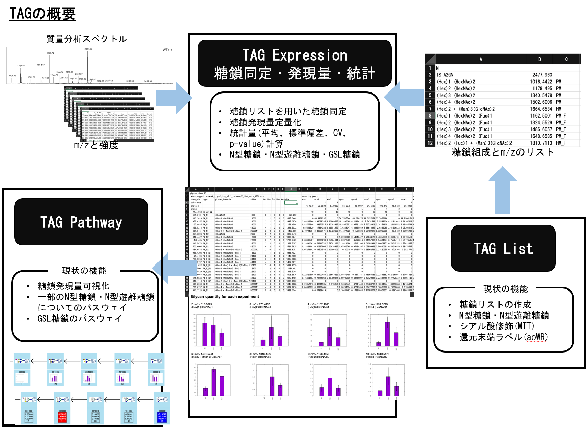
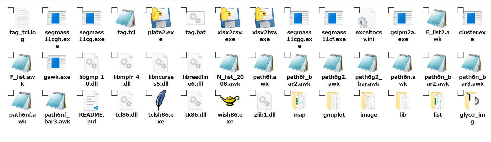
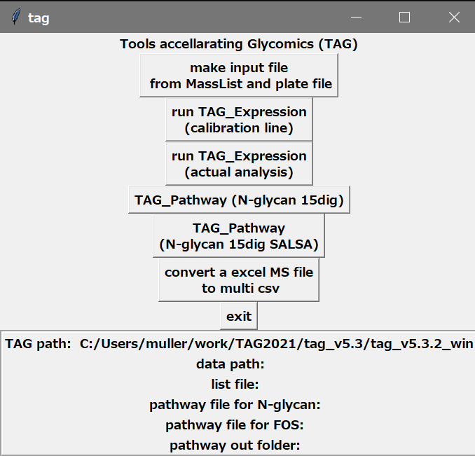
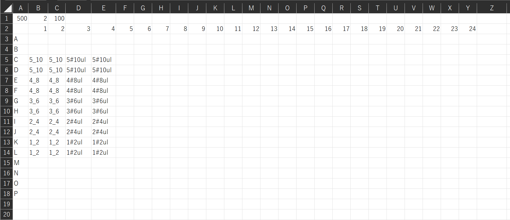
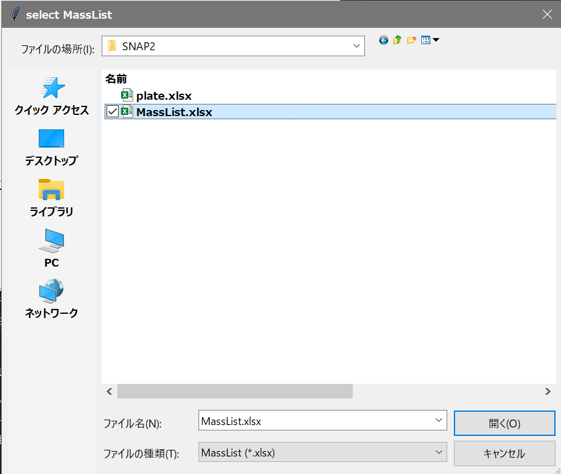
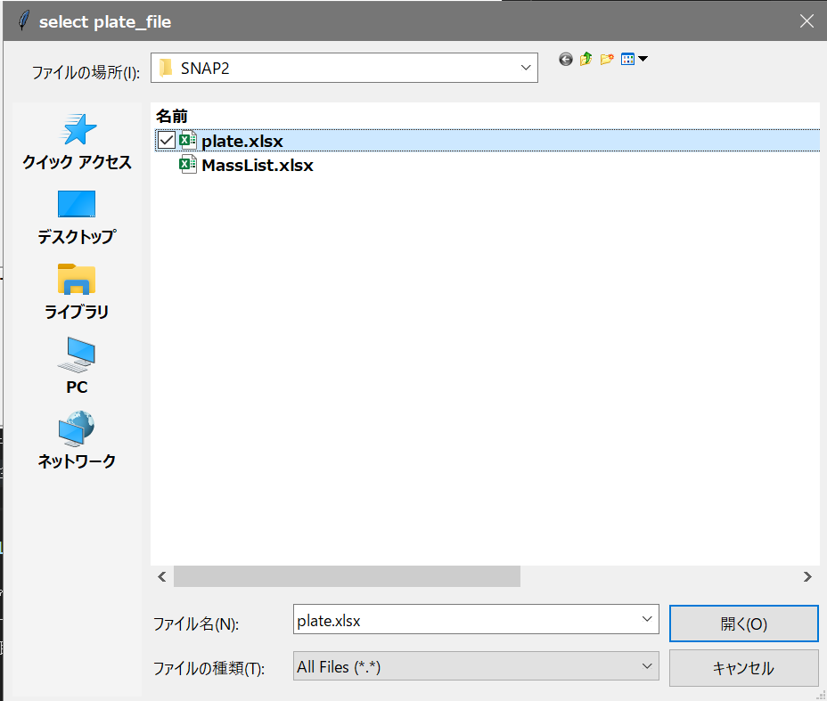
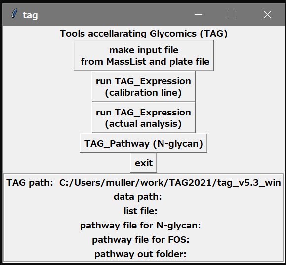
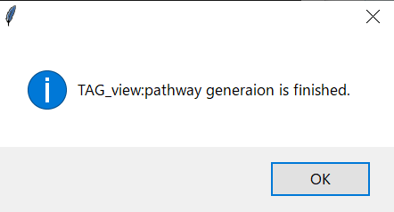

# Toolbox Accelerating Glycomics (TAG) version 5.3.2 manual
## TAG リリース v5.3.2
2022.1.19

## 1.  変更点
バージョン5.3では動作が大幅に変更になりました. 5.2のようにCSVファイルを用意してTAGexpressionを走らせる機能も残っています. これは後述します. 以下に変更点, 新機能を記載します.

- MassListのファイルをxlsxファイルで用意し, 別途プレートをイメージしたxlsxファイルに必要情報を記載して, バージョン5.2にあたるCSVのインプットファイルを自動で生成する機能を追加した. これによってこれまで必要としていたxlsxをcsvに変換するアプリが不要になった.
- 検量線を引く処理(TAG express calburation line)と実際に解析する処理(TAG expression analysis)の２つに実行モードを分けた. 1つのプレートファイルから検量線用のスポットと実測用のスポットの情報を読み取り2つのインプット用のフォルダを作成しそれぞれ必要なcsvファイルを格納します.
- 検量線を引くモードではeach_glycan_quant_point_rcut.htmlを出力し, 検量線のグラフを示す. フィットする直線の傾き, 切片およびR^2を出力します.
- exp_list_zero_cut.csvの記述において糖鎖組成に対するglyconnetへのハイパーリンクを追加しました. csvファイルを開きリンクをクリックするとglyconnectで組成を検索できます.
- 糖鎖IDを15桁に拡張した際に停止していたPathway機能を復活しました. MTTであればこれまで通りに動作します. 15桁の各桁が意味するところは下記の通りです.

||||
|:---|:---|:----|
|1|Hex|
|2|HexNAc|
|3|Fuc|
|4|NeuAc|
|5|NeuGc|
|6|3-8NeuAc| alpha23 or alpha 28 NeuAc|
|7|6NeuAc| alpha26 NeuAc|
|8|3-8NeuGc| alpha23 or alpha 28 NeuGc|
|9|6NeuGc| alpha26 NeuGc|
|10|KDN|
|11|HSO3|
|12|lactone|
|13|Ac|
|14|GlcA|
|15|P|

- 現在2本差の複合型糖鎖に限定ですが, SALSAに対応したPathwayを実装しました. お試し的な要素が強いですが, 今後のためご意見いただけると幸いです.

## 2. 概要
- windows版 tag_v5.3.2_win.zip
  - MS windows10 pro 20H2にて動作確認
  - 開発は mingw上のgcc/fortranで行い静的実行ファイルを生成
- Mac版 tag_v5.3.2_M1mac.zip
  - [for_mac.md](https://github.com/nmiura3/tag/blob/master/for_mac.md)を参照してください.  いくつかアプリケーションをインストールする必要があります.

TAGについての詳細は以下の論文にあります

[Toolbox Accelerating Glycomics (TAG): Glycan Annotation from MALDI-TOF MS Spectra and Mapping Expression Variation to Biosynthetic Pathways,  Biomolecules 2020, 10(10), 1383; https://doi.org/10.3390/biom10101383  ](https://www.mdpi.com/2218-273X/10/10/1383)
TAGを用いて解析を行った場合は上記論文を参照して頂ければ幸いです.

またPathwaySALSA拡張についてはDrawGlycanを用いています.

[DrawGlycan-SNFG: a robust tool to render glycans and glycopeptides with fragmentation information, Glycobiology, Volume 27, Issue 3, March 2017, Pages 200–205](https://doi.org/10.1093/glycob/cww115)

リリースのところからダウンロードしてください. 基本的にフォルダを解凍してできるTAGのフォルダをどこかにおいて, win版であればフォルダ内のtag.batを, mac版であればtag.commandをダブルクリックする事で起動できます.

TAGは以下のソフトを活用して動作しています. 
- [exceltoCSV](https://www.zamzar.com/convert/xls-to-csv/): 複数タブのエクセルフォーマットで出力されたmasslistを複数のCSVに分割するためのソフト
- [tcl/tk 8.6](https://www.tcl.tk/software/tcltk/8.6.html) GUIとコマンドドライバ
- [gawk 4.2.1](https://www.gnu.org/software/gawk/) awkスクリプト実行用
- [gnuplot 5.2](http://www.gnuplot.info/index.html) グラフ描画
#- [cluster 3.0](http://bonsai.hgc.jp/~mdehoon/software/cluster/software.htm#ctv) クラスター解析

TAGは, glycoblotting法などによって得られた質量分析スペクトルデータから糖鎖の発現量を得る, 系列間の平均や検定など主に発現量に関する解析を行うためのTAG_expと, 発現結果を糖鎖の生合成経路に配置, 可視化する事によって糖鎖発現と投薬に対する応答や疾患などの生命現象に対する糖鎖が果たす役割を見出す支援としての一連の可視化・マイニングツールであるTAG_viewからなっています.

現在のバージョンでは, N-glycanとN型遊離糖鎖の解析を行う事ができます. そのための実行ファイルとマップ, 糖鎖リストを含んでいます. GSLについては現在開発中であり, おまけ程度の出来栄えです.

TAGの実行に必要なプログラム群は, tag_v5.3_winまたはtag_v5.3_M1macというフォルダに収められています.これは配布されるファイルを展開する事によって得られます.windows版ではtcl/tk処理系, gnuplotなどのツールも含んでいます.このフォルダをどこかにコピーして使います. mac版ではこれら必要なツールはhomebrewを用いてインストールします. homebrewについては好みもあるかと思いますが, できるだけ実行環境をそろえるという意味合いがありますのでご理解ください. ご自分で環境を構築頂いても結構です.

TAGは, tag.bat(mac版ではtag.command)というバッチファイルをダブルクリックすることで起動します.このバッチファイルへのショートカットをデスクトップなどに作っても大丈夫のようです.（ファイル・フォルダ等の配置について, 空白を含むフォルダ名や日本語のフォルダ名は試していません.空白を含まず日本語のフォルダ名を用いていないパスに置くことを推奨します.）

すると, tag起動画面, 小さなメニューが出現します.

上半分はそれぞれの処理を行うためのボタンで, 下半分にはtagが置かれているフォルダやリストファイルなどの情報が出力されます. それぞれボタンを押すことによってそれぞれプログラムが実行され処理が行われます.立ち上げたばかりの時は, tagが置かれているフォルダ以外のデータフォルダやリストファイルは未選択ですので空欄になっています.処理が実行されるとこれらは表示されます.TAG_Pathwayについて, N-glycanとNFGについてはグラフを貼り付けたタイプと, 発現量の増減を示したタイプの2種類が出力されます.GSL(SALSA)の場合は現在棒グラフを貼り付けたタイプのみ動作します. 5.3にバージョンアップするにあたり糖鎖組成のIDを大幅に変更したため現在このTAG_pathwayは動作しません. 対応しだいこの場でお知らせいたします.

機能としては下記の表にあるものがあります.
| bottun| description of function |
| :-------------------- | :----- |
|make input file from MassList and plate file|質量分析データMassList.xlsxファイルと次節で解説するプレートファイルを用いて検量線(calibration line)および実際の解析(analysis)用のデータを自動で作成します. MassListと同じディレクトリにMassListフォルダを作成しその中にプレートファイルの記述に応じてcalibration_lineとanalysisというフォルダを作成しそれぞれのTAGexpression用のインプットファイル格納します.|
|run TAG_expression  (calibration line)|検量線用のTAGexpressionを実行します.|
|run TAG_expression  (actual analysis)|実際の解析用のTAGexpressionを実行します.  従来のようにインプットを作成した場合はこのボタンで実行してください.|
|TAG_Pathway (N-glycan 15dig)|N-glycan用のTAG_Pathwayを実行します.15桁の糖鎖IDに対応しました. MTT修飾用です. シアル酸はアセチルのみに対応しています.|
|TAG_pathway (N-glycan 15dig SALSA)| SALSA対応したTAG Pathwayを実行します. 現在マップは2本差のみです. 中性糖鎖については上記従来のTAG_Pathwayとマップを共有しています|
|Convert a excel MS file to multi csv| MassListをマルチcsvに変更するボタンです. これまでは同様の機能を持つフリーソフトを同梱していましたが自前で機能を実装しました.|
|exit|TAGを終了します.

## 3. プレート情報ファイルの準備

本バージョンでは, 血清の大量の解析に対応すべくMALDIの384スポットのそれぞれにどのような測定が対応するかをエクセルファイルに記述することでインプットを自動で作成する機能をもっています.

masslistを用意したら, すべてのタブの2行目に内部標準の量やtoleranceなど各種条件を入力します. 各セルに入力する量は以下の通りです.  従来版で入力していたD2, E2に対応する情報を入力するデータをプレート情報から得ます.

| cell | data and description |
| :---- | :----- |
| A1 | 内部標準の量(ug) |
| B1 | tolerance (default 2) |
| C1 | タンパク量(ug)この数値を基にタンパク質100ugあたりの糖鎖量に変換される.血清などの場合でタンパクが無い場合は100を入れておけば数値の変更が無い |
 
  

上図はプレート情報を入力するエクセルファイルの例になります. 検量線を引く際に用いるスポットについては何番目の実験に対応するかの整数と乗せた量をアンダースコア'_'で区切って入力します. 解析に用いる場合は実験の番号とラベルをシャープ'#'で区切って入力します.
タンパク量などをスポットごとに変えたい場合はcsvを作成したのちに, そちらを編集してください.

## 4.エクセルからCSVへコンバート

TAG_expでは, 質量分析の結果についてcsv(コンマ区切り)ファイルでの入力を前提にしています.この入力を作成するために, MassListとプレート情報ファイルplate1.xlsxを用意して下図一番上のボタン（赤枠）をクリックして変換を行います. クリ九すると最初にplateファイルを選択するセレクター, 次にMassListを選択するセレクターが出ますのでそれぞれファイルを選択して開くをクリックして進めてください下さい. 

MassListファイルがあるフォルダにMassListファイル名から'.xlsx'を除いた名前のフォルダを作成し, さらに検量線用のcsvファイルはその中のcalibration_lineというフォルダに, 解析用のcsvファイルはanalysisという名前のフォルダに出力されます. これらをTAG expressionの解析に用いることになります.

MassFileのタブの名前に対して'_0_'と'_1'で囲まれた文字列をプレート情報として取得していますのでBruker以外の質量分析機器の場合はご相談ください. スクリプト変更で対応させて頂きます.

## 5.TAG expressionの実行
TAGのタイトル画面

において, 二番目のボタン **runTAG_Expression (calibration line)** がN-glycanとFNGの検量線を引くプログラムを走らせるもので, 三番ののボタン **runTAG_Expression (analysis)** がN-glycanとFNGの検量線を引くプログラムを走らせるものです.バージョン5.2と同様に, これらのボタンを押すと糖鎖リストを入力するための選択画面が出ますのでリストを選択ます. LIstファイルはListを生成するためのawkスクリプトと一緒にlistディレクトリに格納されています. N-glycanであれば **N_list_auto.csv**をFNGであれば **F_list_auto** をお使いください. 生成した糖鎖リストにに独自に糖鎖を追加する事も可能です. またスクリプトを変更して異なるリストを生成する事も可能です. リストは糖鎖構造（または名前）とm/zおよび糖鎖タイプをカンマで区切るCSV形式で保存してださい.

SALSAやなどにも対応したのでいかに糖鎖リストの整理をしておきます.
|ファイル名|N/F/G| 内容|
|:-----|:-----|:----|
|N_list_2008_BOA.csv|N-glycan|MTT/BOAラベルNa addact|
|N_salsa_glcA_MA_BOA2d.cav|N|SALSA/BOAラベルNa adduct/GlcAはMAラベル|
|N_salsa_glcA_iPA_BOA2d.csv|N|SALSA/BOAラベルNa adduct/GlcAはいPAラベル|
|N_salsa_glcA_aoWRd2.csv|N|MTT/aoWRラベル/GlcAフリー|
|N_list_auto.csv|N|MTT/aoWRラベル|
|F_list_auto.csv|F|MTT/aoWRラベル|
|g219_salsa_sphingomap3.csv|G|SALSA/aoWR|
|g219_mtt_sphingomap.csv|G|MRR/aoWR|

また実行についてはバージョン5.2と変わりませんので[readme_5.2.md](https://github.com/nmiura3/tag/blob/master/READM_5.2.md)を参照してください.

出力ファイルは以下の通りです.

| ファイル名 | 内容 ｜
| :------ | :------|
| out_list.csv | 各リスト内の糖鎖に対して帰属された糖鎖の実測m/z,理論からのずれ,area強度, タンパク量100ugあたりの発現量(pmol).また各系列の平均値, 標準偏差, CV値, t値, p値, また各タイプごとのこれらの集計を収めてあります. |
| exp_list.csv | 上記と同様だが少し省略されたデータが収録されている.糖鎖の発現量, 平均値, 標準偏差, CV値, t値, p値, 各タイプごとの集計が収められています.下の方にタイプ別の集計も掲載していますが, TAGでは可能性のある構造をすべて帰属しているのでダブルカウントしているタイプがあるため, ほんの目安にしかできません. |
| exp_list_zerocut.csv | exp_list.csvからさらにすべての実験について発現量がゼロの糖鎖を削除してコンパクトな表示してあります. exp_list.csvと同様に下の方にタイプ別の集計も掲載していますが, TAGでは可能性のある構造をすべて帰属しているのでダブルカウントしているタイプがあるため, ほんの目安にしかできません.|
| for_pathway_X.csv | TAG_viewでの処理に必要な情報をまとめています.現状ではファイル名は固定で, TAG_expを動作後に実行することを前提としています.Xには, N-glycanの場合はN, FOSの場合はF, O-glycanの場合はO, GSLの場合はGが入ります. |
|each_glycan_quant.html|帰属した糖鎖の発現量を系列ごとの棒グラフにまとめたもの. html形式なので一般のウェブブラウザで閲覧可能 |
|each_glycan_quant_point.html|検量線を引くために散布図にまとめたもの. 直線フィッティングを行ってa,b,R^2も出力している. html形式なので一般のウェブブラウザで閲覧可能 |
|each_glycan_quant_point_rcut.html|検量線を引くために散布図にまとめたものでR^2>0.9の糖鎖のみを示した. 直線フィッティングを行ってa,b,R^2も出力している. html形式なので一般のウェブブラウザで閲覧可能 |
|calb_ms_value_plot.html|糖鎖を帰属する際に用いるリストにある理論的m/zと実測値の理論からのずれΔm/zの散布図. 図の詳細は論文を参照ください.|
| *.dat1, *.dat2 | 糖鎖を帰属する際に行うクラスタリングの精度をチェックするためのグラフを作成する元データ.tolerance値でピックした糖鎖についての*.dat1は理論m/zと実測のずれで*.dat2はピックした糖鎖の理論m/zと実測値からのずれが収められています. |
| *.png | 上記データとクラスタリングデータから最小二乗法によって引いた直線をプロットしたグラフ.白抜き四角がtoleranceでピックしたデータ, 塗りつぶされた丸がクラスタリングによってピックした糖鎖のデータ. |
| *.eps | 上記のepsバージョン.白黒. |
| *.plt | グラフデータを描画するためのgnuplotスクリプト |
| mkgraph.plt | *.pltをまとめて描画するためのスクリプト |
 

## 5.TAG_Pathwayの実行

バージョン5.3で導入した15桁の糖鎖IDに対応したPathwayです. 現在N-glycanのMTTとSALSAにのみ対応しています. SALSAとMTTで使い分けてください. MTTはNeu5Acにのみ対応しています. 使い方は以下の通りこれまでと変わりません. pathway用のcsvファイルを選択し, 出力先を指定するだけです.

TAG Expressionを実行した際にできる **for_pathway_X.csv** と用意されたマップファイルから発現量（変動）を生合成経路へマップする. TAGのメニュ―画面から下4つのボタンがTAG_pathwayの実行に対応している.

| ボタン | 機能 |
| :---- | :---- |
| TAG Pathway (N-glycan) | N-glycanのpathwayを描画する. 発現量の棒グラフをマッピングしたpathwayと発現変動を色(増：赤, 減:青)で示したpathwayの両方を出力する 出力はhtml形式で行われ, pathwayはウェブブラウザで閲覧する事ができる. |
| TAG Pathway (FNG) | N型遊離糖鎖のpathwayを描画する. 出力についてはN-glyucanと同様. |
| TAG Pathway (N-glycan+FNG) |N-glycanとN型遊離糖鎖の混合pathwayを描画する. その他は同じ. 入力の際にN-glycanとFNGの結果ファイルの入力が求められる. |
| TAG Pathway (barchart GSL SALSA) | SALSA法によるGSL解析結果を生合成経路にマップする. 出力は発現量の棒グラフのみ. |

前節で事項したN-glycanの解析結果からTAG Pathwayを実行する. **TAG Pathway (N-glycan)** をクリックする. ファイル選択画面が表示されるので, **for_pathway_N.csv** を選択する. 結果をどこのディレクトに出力するかを次の画面で選択する.
終了するとメッセージが表示される.

TAG Pathwayの出力ファイルは以下の通り
| ファイル名 | 内容 |
| :---- | :----|
|barchart_pathway.html | 生合成経路に発現量の棒グラフをマップ. これを見るとどの糖鎖がどのような変化をしているかが一覧できる. |
|系列A - 系列B.html  (ex. wt- - NPC-.html) | 系列間の発現量増減をマッピングした生合成経路図. これによってt検定的に有意に増加した糖鎖を生合成経路上で一覧可能.|

SALSA用のPathwayを実行した場合には上記ファイル名に中性糖鎖であればPathway2_N_neutral_2本鎖であればPathway2_N_1a_1hy_という接頭辞が付きます.

## 6. その他

- 現在のバージョンでは糖鎖リストの長さは2,000まで, 測定されるMSの実験数は200に限定されています. 技術的な問題もありwindowsとmacの両方ででメモリモデルの壁を破れず苦労しています. メモリモデル問題をクリアできたとしても, 8GBメモリが必要とかいうPCでは現実てきではないので, 配列の節約も含めて検討に入っています. 目標であるウェブブラウザ上での動作版に合わせて検討を進めていきます.

- exp_list_zero_cut.csvでtotalの表示がおかしい

- おかしな点があれば, ご連絡いただければできる限り対応します. 作者は別に本務があるため時間がかかる場合がありますが, ご連絡いただければ, 見通しも含めできるだけ早くリプライをさせて頂きます.
連絡先: miura.nobuaki3@gmail.com

- 本研究の一部はJSPS科研費 21K12124の助成を受けて進められています.

