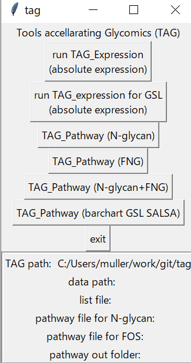

# Toolbox Accelerating Glycomics (TAG) version 5.2 manual
## TAG リリース v5.3

## 1. 概要
- windows版 tag_v5.3_win.zip
- Mac版 tag_v5.3_mac.zip (調整中)

詳細は以下の論文にあります

[Toolbox Accelerating Glycomics (TAG): Glycan Annotation from MALDI-TOF MS Spectra and Mapping Expression Variation to Biosynthetic Pathways,  Biomolecules 2020, 10(10), 1383; https://doi.org/10.3390/biom10101383  ](https://www.mdpi.com/2218-273X/10/10/1383)

リリースのところからダウンロードしてください. 基本的にフォルダを解凍してできるTAGのフォルダをどこかにおいて, win版であればフォルダ内のtag.batを, mac版であればtag.commandをダブルクリックする事で起動できます.

TAGは以下のソフトを活用して動作しています. 
- [exceltoCSV](https://www.zamzar.com/convert/xls-to-csv/): 複数タブのエクセルフォーマットで出力されたmasslistを複数のCSVに分割するためのソフト
- [tcl/tk 8.6](https://www.tcl.tk/software/tcltk/8.6.html) GUIとコマンドドライバ
- [gawk 4.2.1](https://www.gnu.org/software/gawk/) awkスクリプト実行用
- [gnuplot 5.2](http://www.gnuplot.info/index.html) グラフ描画
- [cluster 3.0](http://bonsai.hgc.jp/~mdehoon/software/cluster/software.htm#ctv) クラスター解析

-•	Microsoft Visual Basic 6.0 コモン コントロール 
のインストールが必要（現在も必要かは不明：要確認windowsの場合）

TAGは, glycoblotting法などによって得られた質量分析スペクトルデータから糖鎖の発現量を得る, 系列間の平均や検定など主に発現量に関する解析を行うためのTAG_expと, 発現結果を糖鎖の生合成経路に配置, 可視化する事によって糖鎖発現と投薬に対する応答や疾患などの生命現象に対する糖鎖が果たす役割を見出す支援としての一連の可視化・マイニングツールであるTAG_viewからなっています.

現在のバージョンでは, N-glycanとN型遊離糖鎖の解析を行う事ができます. そのための実行ファイルとマップ, 糖鎖リストを含んでいます. GSLについては現在開発中であり, おまけ程度の出来栄えです.

TAGの実行に必要なプログラム群は, tag_v5.2というフォルダに収められています.これは配布されるtag_v4.zipを展開する事によって得られます.このフォルダにはTAGを動作させるのに必要なツールである（exceltocsv.exe, tcl/tk処理系, gnuplotなどのツールも含んでいます.このフォルダをどこかにコピーして使います.

TAGは, tag.bat(mac版ではtag.command)というバッチファイルをダブルクリックすることで起動します.このバッチファイルへのショートカットをデスクトップなどに作っても大丈夫のようです.（ファイル・フォルダ等の配置について, 空白を含むフォルダ名や日本語のフォルダ名は試していません.空白を含まず日本語のフォルダ名を用いていないパスに置くことを推奨します.）

すると, tag起動画面, 小さなメニュー出現します.

上半分はそれぞれの処理を行うためのボタンで, 下半分にはtagが置かれているフォルダやリストファイルなどの情報が出力されます. それぞれボタンを押すことによってそれぞれプログラムが実行され処理が行われます.立ち上げたばかりの時は, tagが置かれているフォルダ以外のデータフォルダやリストファイルは未選択ですので空欄になっています.処理が実行されるとこれらは表示されます.TAG_viewについて, N-glycanとNFGについてはグラフを貼り付けたタイプと, 発現量の増減を示したタイプの2種類が出力されます.GSL(SALSA)の場合は現在棒グラフを貼り付けたタイプのみ動作します.

## 2. エクセルファイルの準備

masslistを用意したら, すべてのタブの2行目に内部標準の量やtoleranceなど各種条件を入力します. 各セルに入力する量は以下の通りです.

| cell | data and description |
| :---- | :----- |
| A2 | 内部標準の量(ug) |
| B2 | tolerance (default 2) |
| C2 | タンパク量(ug)この数値を基にタンパク質100ugあたりの糖鎖量に変換される.血清などの場合でタンパクが無い場合は100を入れておけば数値の変更が無い |
| D2 |何番目の系列に属するかを整数で指定 |
| E2 |系列のショーネーム |
 
  

## 3.エクセルからCSVへコンバート

TAG_expでは, 質量分析の結果についてcsv(コンマ区切り)ファイルでの入力を前提にしています.この入力を作成するために, 多くのシートを含むエクセルファイルを複数のcsvに変換します.この変換には, exceltoCSVを用いています(windows版).

ウィンドウの上部にエクセルファイルをドロップすればCSVに分割できます. 下では出力先も指定できますので, 適宜指定すると良いと思います. できたCSVファイルを1つのディレクトリに納めます. GSLの解析は酵素なしの実験との差を取ります. この場合はそれぞれ用意したmasslistから別々にCSVを作成し, それぞれ独立にディレクトリに納めてください.

## 4.TAG expressionの実行
TAGのタイトル画面

において, 一番上のボタン **runTAG_Expression (absolute expression)** がN-glycanとFNGの解析を行うプログラムを走らせるものです.このボタンを押すと糖鎖リストを入力するための選択画面が出ますのでリストを選択ます. LIstファイルはListを生成するためのawkスクリプトと一緒にlistディレクトリに格納されています. N-glycanであれば **N_list_auto.csv**をFNGであれば **F_list_auto** をお使いください. これらに独自に糖鎖を追加する事も可能です. またスクリプトを変更して異なるリストを生成する事も可能です. リストは糖鎖構造（または名前）とm/zおよび糖鎖タイプをカンマで区切るCSV形式で保存してださい. 

ここでは, 論文にもあった[Niemann–Pick disease type C (NPC)](https://pubs.acs.org/doi/10.1021/ac702124d)の測定データを用いて説明します. これらの測定データはtag_NP_tutorialというディレクトリに, N-glycanとFNGというフォルダにそれぞれCSVで保存されています.

**runTAG_Expression (absolute expression)** をクリックすると, リストの選択画面が表示されます. N-glykcanの解析を行うために **N_list_auto.csv**を選択します.

**開く**をクリックすると, 引き続きCSVファイルがあるディレクトリを指定する画面にが拓きます. N-glycanのデータが入っているディレクトリを選択し **OK**をクリックすると計算が始まります.

計算が完了すると下記の終了メッセージが表示されます.

CSVがあったディレクトリに各種ファイルが出力されます.
各種出力されるファイルの見方については論文を参照してください.
できるファイルについては以下のとおり.

| ファイル名 | 内容 ｜
| :------ | :------|
| out_list.csv | 各リスト内の糖鎖に対して帰属された糖鎖の実測m/z,理論からのずれ,area強度, タンパク量100ugあたりの発現量(pmol).また各系列の平均値, 標準偏差, CV値, t値, p値, また各タイプごとのこれらの集計を収めてあります. |
| exp_list.csv | 上記と同様だが少し省略されたデータが収録されている.糖鎖の発現量, 平均値, 標準偏差, CV値, t値, p値, 各タイプごとの集計が収められています.下の方にタイプ別の集計も掲載していますが, TAGでは可能性のある構造をすべて帰属しているのでダブルカウントしているタイプがあるため, ほんの目安にしかできません. |
| exp_list_zerocut.csv | exp_list.csvからさらにすべての実験について発現量がゼロの糖鎖を削除してコンパクトな表示してあります. exp_list.csvと同様に下の方にタイプ別の集計も掲載していますが, TAGでは可能性のある構造をすべて帰属しているのでダブルカウントしているタイプがあるため, ほんの目安にしかできません.|
| for_pathway_X.csv | TAG_viewでの処理に必要な情報をまとめています.現状ではファイル名は固定で, TAG_expを動作後に実行することを前提としています.Xには, N-glycanの場合はN, FOSの場合はF, O-glycanの場合はO, GSLの場合はGが入ります. |
|each_glycan_quant.html|帰属した糖鎖の発現量を系列ごとの棒グラフにまとめたもの. html形式なので一般のウェブブラウザで閲覧可能 |
|calb_ms_value_plot.html|糖鎖を帰属する際に用いるリストにある理論的m/zと実測値の理論からのずれΔm/zの散布図. 図の詳細は論文を参照ください.|
| *.dat1, *.dat2 | 糖鎖を帰属する際に行うクラスタリングの精度をチェックするためのグラフを作成する元データ.tolerance値でピックした糖鎖についての*.dat1は理論m/zと実測のずれで*.dat2はピックした糖鎖の理論m/zと実測値からのずれが収められています. |
| *.png | 上記データとクラスタリングデータから最小二乗法によって引いた直線をプロットしたグラフ.白抜き四角がtoleranceでピックしたデータ, 塗りつぶされた丸がクラスタリングによってピックした糖鎖のデータ. |
| *.eps | 上記のepsバージョン.白黒. |
| *.plt | グラフデータを描画するためのgnuplotスクリプト |
| mkgraph.plt | *.pltをまとめて描画するためのスクリプト |
 

SLSA法でのGSLの場合, リストは

## 5.TAG_Pathwayの実行

TAG Expressionを実行した際にできる **for_pathway_X.csv** と用意されたマップファイルから発現量（変動）を生合成経路へマップする. TAGのメニュ―画面から下4つのボタンがTAG_pathwayの実行に対応している.

| ボタン | 機能 |
| :---- | :---- |
| TAG Pathway (N-glycan) | N-glycanのpathwayを描画する. 発現量の棒グラフをマッピングしたpathwayと発現変動を色(増：赤, 減:青)で示したpathwayの両方を出力する 出力はhtml形式で行われ, pathwayはウェブブラウザで閲覧する事ができる. |
| TAG Pathway (FNG) | N型遊離糖鎖のpathwayを描画する. 出力についてはN-glyucanと同様. |
| TAG Pathway (N-glycan+FNG) |N-glycanとN型遊離糖鎖の混合pathwayを描画する. その他は同じ. 入力の際にN-glycanとFNGの結果ファイルの入力が求められる. |
| TAG Pathway (barchart GSL SALSA) | SALSA法によるGSL解析結果を生合成経路にマップする. 出力は発現量の棒グラフのみ. |

前節で事項したN-glycanの解析結果からTAG Pathwayを実行する. **TAG Pathway (N-glycan)** をクリックする. ファイル選択画面が表示されるので, **for_pathway_N.csv** を選択する. 結果をどこのディレクトに出力するかを次の画面で選択する.
終了するとメッセージが表示される.

TAG Pathwayの出力ファイルは以下の通り
| ファイル名 | 内容 |
| :---- | :----|
|barchart_pathway.html | 生合成経路に発現量の棒グラフをマップ. これを見るとどの糖鎖がどのような変化をしているかが一覧できる. |
|系列A - 系列B.html  (ex. wt- - NPC-.html) | 系列間の発現量増減をマッピングした生合成経路図. これによってt検定的に有意に増加した糖鎖を生合成経路上で一覧可能.|

## 6. その他

おかしな点があれば, ご連絡いただければできる限り対応します. 作者は別に本務があるため時間がかかる場合がありますが, ご連絡いただければ, 見通しも含めできるだけ早くリプライをさせて頂きます.

miura.nobuaki3@gmail.com

