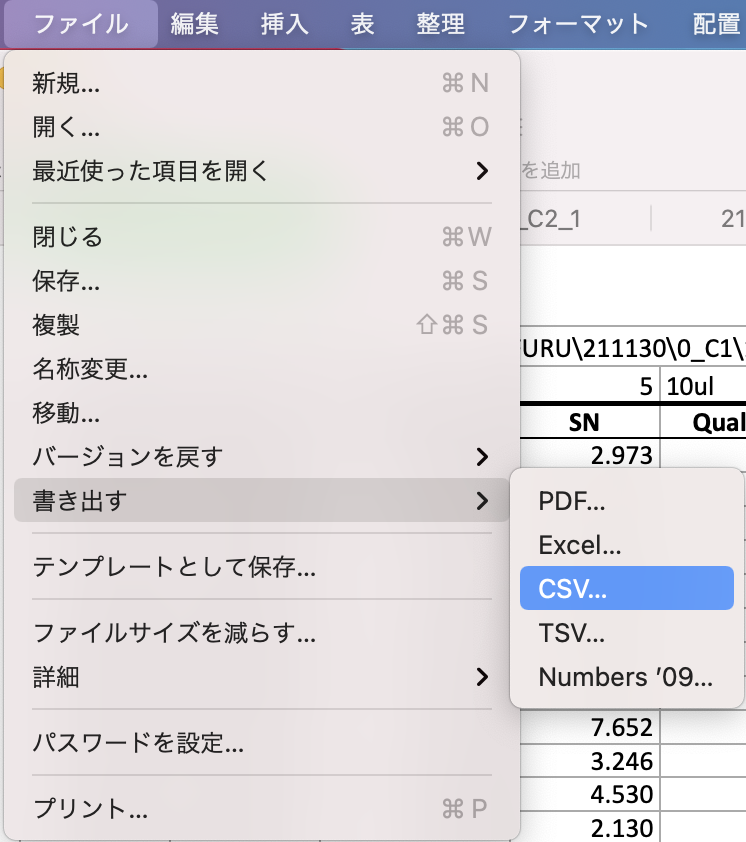

# Toolbox Accelerating Glycomics (TAG) version 5.2 manual
## M1 Mac版について

Mac版では, 糖鎖リストの長さを5,000に限定し, 実験数を100としました.

Windows版は, ロードモジュールを静的に結合して作成していました. よってwindows版はフォルダをコピーするだけで動作しました. Macではこのようなビルドができず（少なくとも開発者の技術力において）必要なライブラリをHOmebrew経由でインストールして動作させます. 以下にその方法について述べます.

## 1.バージョン
インストールすべきソフトウェアのバージョンを記します. 2021年12月の段階でインストールしたバージョンです. 基本的に
```
brew install XXXX(アプリ名)
```
でインストールできます. バージョンが合わない場合はバージョンを指定してインストールしてください.

|ソフトウェア|バージョン|
|:-----|:-----|
|gcc|11.2.0_3|
|tcl-tk| 8.6.12|
|gnuplot|5.4.2|
|gawk|5.1.1|

homebrewのインストールは
https://brew.sh/index_ja


## 2. CSVの準備
質量分析装置からmass listを取り出し, これをcsvファイルに変換する必要があります. これはMacの標準ソフトnumbersで行えます. エクセルファイルを読み込んだのちに, ファイル--> 書き出し-->csvとたどって保存してください.



あとはwindows版と同じ（はず）です.

## 3. Mac版での注意点
- 系列のソートが今一つうまく行っていないようです. 平均値その他統計量は正しいと思っていますが, ソートがうまく行っていないのでグラフ糖のキャプションが変な場合があります. その際にはお手数ですが, CSVファイルがあるフォルダにできるinputというファイルを編集してあらかじめソートしてください. 各系列の最初のショートネームがグラフのラベルに用いられます.
- グラフについてはエラーバー付きのポイントプロットに対応しました. X軸の数値には対応していませんが, 均等割で濃度など決めておけば直線性などの目安になります.このグラフはeach_glycan_quant_point.htmlに出力されます.
- 糖鎖のIDを変更したため現状パスウェイには対応していません.追ってやっていきます.
